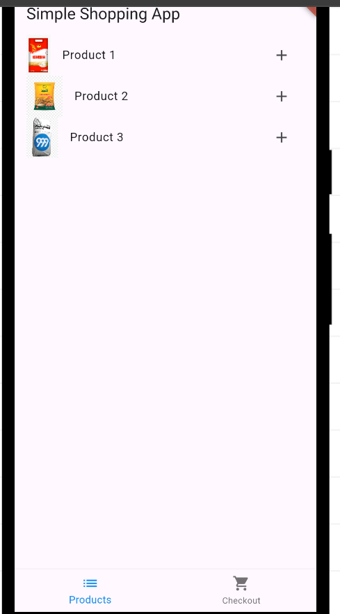
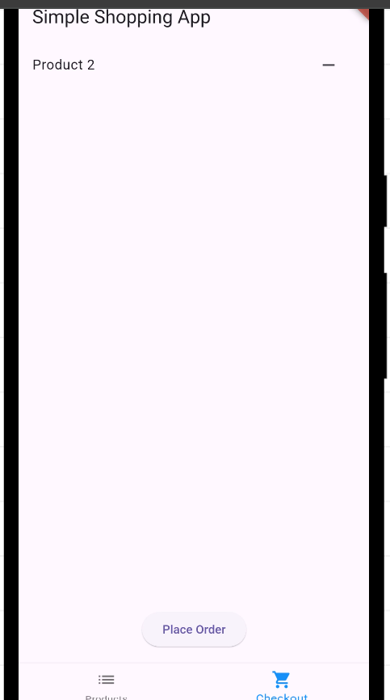
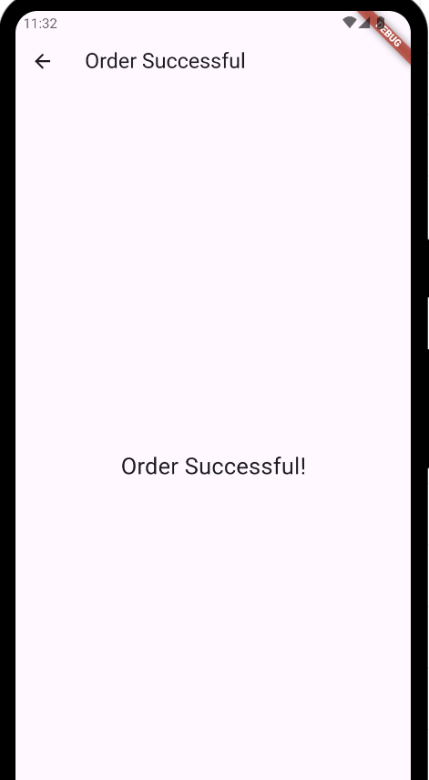

   

  <h3><b>Simple shopping app README</b></h3>

# 📗 Table of Contents

- [📖 About the Project](#about-project)
  - [🛠 Built With](#built-with)
    - [Tech Stack](#tech-stack)
    - [Key Features](#key-features)
- [💻 Getting Started](#getting-started)
  - [Setup](#setup)
  - [Prerequisites](#prerequisites)
  - [Install](#install)
  - [Screenshots](#screenshots)
  - [APK Download link](#apk-download)
  - [Appetize showcase](#appetize-showcase)
- [👥 Authors](#authors)
- [🔭 Future Features](#future-features)
- [🤝 Contributing](#contributing)
- [⭐️ Show your support](#support)
- [🙏 Acknowledgements](#acknowledgements)
- [❓ FAQ ](#faq)
- [📝 License](#license)

# 📖 Moblie Portfolio 

 **Moblie Portfolio** a simple shopping mobile app.

## 🛠 Built With 

### Tech Stack 

  
Dart

  <ul>
    <li><a href="https://dart.dev/">Dart</a></li>
  </ul>

  
Flutter

  <ul>
    <li><a href="https://flutter.dev/">Flutter</a></li>
  </ul>

### Key Features 

 The following are key features that are displayed on the portfolio

- **Product Screen**
- **Checkout screen**
- **Order Success screen** 
 

(<a href="#readme-top">back to top</a>)

(<a href="#readme-top">back to top</a>)

## 💻 Getting Started 

To get a local copy up and running, follow these steps.

### Prerequisites

In order to run this project you need to install and have the following as follows:
- Visual Studio Code IDE
- Flutter

## Setup Instructions
1. Clone the repository: `git clone https://github.com/AsciencioAlex/shopping-app.git`
2. Navigate to the project directory: `cd shopping-app`
3. Run `flutter pub get` to install dependencies.
4. Run the app on an emulator or physical device: `flutter run`

## Screenshots

## APK Download Link
[Download APK](https://drive.google.com/file/d/1uMALrFQpgnmjKRmGAJ43HqpVNIYQcCYN/view?usp=drive_link)

## Appetize.io Showcase
[Appetize.io Demo](https://appetize.io/app/u37uj6zr2hu2ftu7ahszcjmg4a?device=pixel7&osVersion=13.0)

(<a href="#readme-top">back to top</a>)

## 👥 Authors 

👤 **Alex Asciencio**
- GitHub: [@githubhandle](https://github.com/AsciencioAlex)
- Twitter: [@twitterhandle](https://twitter.com/Codnetech)
- LinkedIn: [LinkedIn](https://ke.linkedin.com/in/alex-asciencio-413612b9)  

## 🔭 Future Features 

The other features that will be added to this project are:

- [ ] **additional pages for the products category**
- [ ] **Additional of payment methods**
- [ ] **more features and widgets**

(<a href="#readme-top">back to top</a>)

## 🤝 Contributing 

Contributions, issues, and feature requests are welcome!

Feel free to check the [issues page](https://github.com/AsciencioAlex/Mobile-finish-portfolio/issues).

(<a href="#readme-top">back to top</a>)

## ⭐️ Show your support s

If you like this project feel free to clone it and take some features that will enhance your project aswell.

(<a href="#readme-top">back to top</a>)

## 🙏 Acknowledgments 
 I thank HNG  for this opportunity

(<a href="#readme-top">back to top</a>)

## ❓ FAQ (OPTIONAL) 

- **Can I run the project without installing on terminal?**

  - Yes, you can run it directly on the browser

- **Can I build such as page from scratch and where can I learn?**

  - Yes its possible. Join HNG Internship(https://hng.tech/internship/) and HNG Tech (https://hng.tech/)

## 📝 License 

This project is [MIT](./LICENSE) licensed.

(<a href="#readme-top">back to top</a>)

